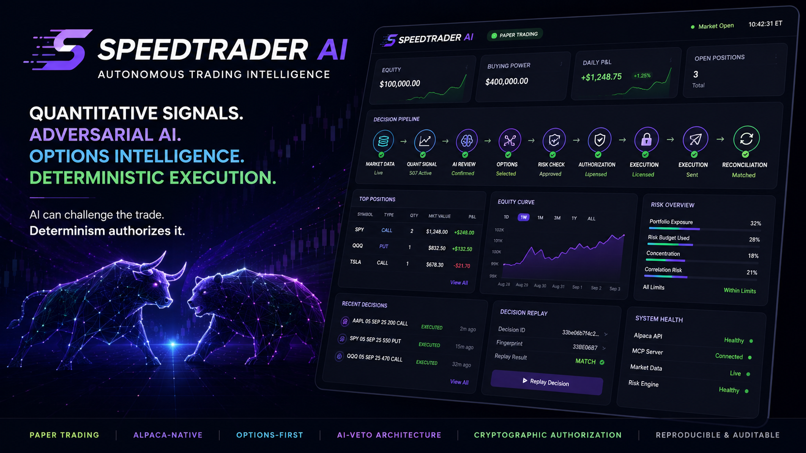

<sub><i>Concept banner. The dashboard figures in it are illustrative design
mock-ups, not results — this project makes no performance claim anywhere. The
real generated command centre is <code>data/dashboard.html</code>.</i></sub>

# SpeedTrader AI

**An options trading agent where the AI can veto a trade but can never cause one.**

Alpaca AI Trading Agents Hackathon · Paper trading only · 1020 tests

```bash
pip install -e ".[dev]"
python scripts/run_options_demo.py --replay --dashboard
```

No API key. No network. No configuration. That runs the complete decision cycle,
re-derives every decision from its stored snapshot, and writes the command centre.

**Full setup, live paper trading, and the strategy plugin system:** see
[`docs/SUBMISSION.md`](docs/SUBMISSION.md) for the complete engineering log —
what was built, what was rejected and why, and the exact commands to reproduce
every claim in this README.

| | |
|---|---|
| **Team** | _TODO — owner to fill in team name and contact email before submitting_ |
| **License** | [MIT](LICENSE) |
| **Live verification** | Real paper orders placed via Alpaca's official MCP server (see [Live Alpaca](#live-alpaca)) |

---

## The idea

Most AI trading agents work like this:

```
LLM proposes a trade  ──►  guardrails try to catch bad ones  ──►  broker
```

The guardrails are the last line of defence, and the LLM's mistakes are the
thing they have to catch. SpeedTrader inverts it:

```
S07 (ported quant strategy)
   ──►  deterministic risk engine        decides IF and HOW MUCH
   ──►  options sizing                   converts risk budget to contracts
   ──►  AI adversarial review            may only CONFIRM · ABSTAIN · VETO
   ──►  single-use execution licence
   ──►  Alpaca (paper) via its MCP server
```

By the time the model is consulted, the trade already exists and is already
approved. **The AI's entire vocabulary is three words**, and none of them can
enlarge a position, loosen a limit, change a strike, or authorize anything.

This is not enforced by telling the model to behave — a prompt is a request, and
prompt injection is real. It is enforced by the **schema**: the review object has
four fields (`verdict`, `confidence`, `reasoning`, `concerns`) and
`additionalProperties: false`. A model returning `{"verdict": "CONFIRM",
"quantity": 99999}` changes nothing, and there is a test that proves exactly
that against the real pipeline.

The practical consequence: **model capability is a reasoning decision, not a
safety one.** Swap in the strongest model available and its maximum authority is
still to cancel one trade.

---

## The failure mode is inverted, deliberately

Because this layer can only *subtract*, "fail closed" here means **change
nothing** — not "block everything".

| What happens | What the system does |
|---|---|
| Model times out | ABSTAIN · the deterministic decision stands |
| Model returns malformed JSON | ABSTAIN · never guessed at |
| Model refuses | ABSTAIN |
| No API key at all | ABSTAIN · honest "no model was consulted" |
| Model says VETO with a reason | **Trade cancelled** |

If an LLM outage vetoed instead, a vendor going down would silently halt all
trading. Mutation testing confirms it: making failures veto breaks 22 tests.

---

## Why long single-leg options

Chosen for correctness, not convenience.

> **Maximum loss = the premium paid, known exactly at entry, under every price path.**

An equity stop-loss is an *intention* — price can gap through it overnight. A
long option cannot lose more than its debit. So the risk engine sizes against an
**exact** maximum loss rather than an assumed one:

```
equities:  shares    = risk_money / stop_distance      ← a price distance
options:   contracts = risk_budget / (ask × 100)       ← the entire amount at risk
```

These are not the same formula with different names, and the options path never
reuses the equity one. Priced at the **ask**, never the mid — the mid understates
max loss by half the spread on every position.

A bearish signal buys a **long put**, never a short call: risk stays defined in
both directions.

---

## What a judge can verify in 60 seconds

```bash
python scripts/run_options_demo.py           # all six scenarios
python -m pytest -q                          # 1020 passed
python scripts/mutation_test.py              # 64 mutants; every guard is load-bearing
```

| Scenario | Demonstrates |
|---|---|
| `breakout` | 3 contracts, **$960 max loss** inside a $1,000 budget |
| `veto` | AI cancels an approved trade — nothing reaches the broker |
| `no-signal` | S07 declines; the decision is still recorded |
| `illiquid` | spread too wide → no tradeable contract |
| `broke` | one contract costs $6,200 vs a $1,000 budget → rejected |
| `timeout` | broker times out → **UNKNOWN**, not retried, never "filled" |

Then read one decision:

```bash
cat data/decisions/decisions-*.jsonl | head -1 | python -m json.tool
```

Every record carries the snapshot, the signal, **the cost assumptions behind its
EV**, all 22 deterministic checks, the contract chosen *and what was rejected and
why*, the AI review with the model that produced it, and the execution outcome.

### And against the real broker

The demo above is deterministic and offline, which is what makes it a
*demonstration*. `run_live_paper.py` is the same pipeline with Alpaca supplying
the bars, the option chain, the quotes and the account balance:

```bash
python scripts/run_live_paper.py --scan                # decide across a watchlist
python scripts/run_live_paper.py --symbol SPY          # one name, no order sent
python scripts/run_live_paper.py --symbol SPY --submit # actually place it
```

**The default sends nothing.** Without `--submit` the orchestrator is not given a
broker reference at all, so a dry run is structural rather than a flag someone
can forget. `--allow-stale` lets you watch the pipeline outside market hours and
is **refused together with `--submit`**: trading on a stale bar is the exact
thing the freshness gate exists to prevent.

Running it is not a formality — three real defects in this repository were found
only this way, and each is now pinned by a mutant (`quote-batch-uncapped`,
`envelope-unbounded`, `lookback-calendar-units`). The third is the instructive
one: Alpaca's bar request is bounded by a wall-clock start time, but a strategy
asks in *bars*, and a calendar week holds 168 hours against ~32.5 market hours.
The window was computed in the wrong unit, so a request for the 891 hourly bars
an EMA200 needs returned 660 and the snapshot builder refused **every** hourly
symbol. It failed closed, correctly — and could never have failed any other way.
No fixture would have shown that, because a fixture returns the bars you wrote
into it.

---

## The part competitors cannot do: replay

Every LLM trading agent shares one documented weakness, stated by its own
authors — model output is not reproducible, so a decision cannot be audited
afterwards. SpeedTrader's decisions *can* be re-derived, because the part that
decides is deterministic.

```
$ python scripts/run_options_demo.py --replay

  315c42afbae355ad  reproduced
  3cc211821bdfd44a  reproduced (AI vetoed — the one thing it can change)
  f85abf8442f2541e  reproduced

  6/6 decisions re-derived from their stored snapshot alone, with the AI
  never consulted.
```

The 16-character fingerprint identifies **what the deterministic system
decided**, and it **excludes the AI review by construction**. So the same market
state hashes identically whether the model confirmed, abstained, timed out,
returned hostile output, or never ran. The project's central claim reduces to
comparing two strings — and a `CONFIRM` run and an `ABSTAIN` run producing the
same fingerprint is asserted end-to-end by test.

A **veto** does change the outcome, so it is tracked *beside* the fingerprint
rather than folded into it. Merging them would destroy the ability to prove the
property above.

If a replay diverges, the differing field is named. "Not reproducible" alone is
useless; an auditor needs to know which field moved.

---

## Command centre

```bash
python scripts/build_dashboard.py --live      # real paper account + journal
open data/dashboard.html
```

A single self-contained HTML file — no server, no build step, no network. It
renders the real pipeline: every figure comes from a persisted decision record,
from the Alpaca paper account, or from the runtime's own health object.

It shows market state, the quantitative signal, the AI advisory lane, the
deterministic authority lane, the execution outcome lane, options contract and
sizing with **max loss labelled EXACT**, every deterministic check with its
observed value, rejected option candidates with the reason each was dropped,
the order lifecycle with intent phase beside broker state, and
**"why we did NOT trade"** attributing each declined decision to the layer that
stopped it.

**There is no JavaScript on the page, and that is a security property rather
than a stylistic one.** The page renders text authored by a language model and
by a broker; with no `<script>` element there is no execution path for a hostile
string — not a mitigated one, an absent one. Interactivity is CSS `:checked` and
`<details>`. A test asserts the page contains no `<script`, no external URL and
no event-handler attribute, and CI regenerates the page and scans it for
credential-shaped literals.

Provenance is badged on every figure — `PAPER`, `SIMULATED`, `ESTIMATED`,
`EXACT` — and a broker that cannot be reached omits the account panel rather
than showing stale or estimated numbers. A zero is rendered as a zero.

---

## Backtest — and what it deliberately refuses to measure

```bash
python -m pytest tests/unit/evaluation -q
```

Walk-forward validation with cost sensitivity on the **underlying S07 signal**.

**It does not backtest the options strategy, and that is a data fact rather than
a shortcut.** Doing so needs historical option chains — bid/ask per contract per
day — which this repository does not have. The only way to produce option prices
without them is a pricing model plus a volatility assumption, and a backtest
built that way measures *the pricing model*, not the strategy. So the question
the data supports is answered and options P&L is left unanswered rather than
answered wrongly.

Integrity properties, each with the mutant that proves it: look-ahead is
prevented structurally — `bars[:i]` decides, `bars[i:]` resolves, never
overlapping (`backtest-look-ahead`, `backtest-entry-bar-resolves`); a bar
containing both stop and target scores as a **loss**, because OHLC cannot reveal
intrabar order (`backtest-optimistic-bar`); unresolved trades are excluded
rather than counted as wins (`backtest-unresolved-as-win`); and with no trades
the win rate is `None`, not `0.0` (`backtest-zero-win-rate`). **No Sharpe
ratio** — on a few dozen trades it would imply confidence the sample cannot
support.

---

## Safety properties, and how each is proven

Each row names the mutant that proves it. Run any one of them yourself with
`python scripts/mutation_test.py -k <id>`.

| Property | Enforcement | Mutant that proves it |
|---|---|---|
| AI cannot enlarge a trade | schema has no such field | `schema-open` (+ hostile-model test, end to end) |
| AI outage cannot halt trading | failures ABSTAIN | `veto-on-failure` |
| The AI's one effect is subtractive | `vetoed = verdict is VETO` | `veto-inverted` |
| Reproducibility excludes the AI | allowlisted fingerprint payload | `fingerprint-includes-ai` |
| No order without a licence | required positional arg | `adapter-skips-verify`, `auth-any-object` |
| A licence cannot be forged | HMAC, per-process secret | `auth-unsigned` |
| A licence works once | single-use nonce | `auth-replay`, `auth-nonce-reusable` |
| Approve small, submit large | proposal bound by hash | `auth-proposal-binding`, `adapter-quantity-drift` |
| Portfolio changed since approval | portfolio bound by hash | `auth-portfolio-binding` |
| A stale licence cannot be stretched | expiry checked before bindings | `auth-expiry` |
| Licence never persisted | not serialisable; repr redacts | `auth-serialisable` |
| SUBMITTED ≠ FILLED | no FILLED state in the adapter | `retry-on-open`, `partial-fill-invisible` |
| Ambiguity is never called refusal | classifier defaults to UNKNOWN | `ambiguity-becomes-rejection` |
| Retry cannot double-fill | idempotency key = the nonce | `retry-anything`, `adapter-idempotency-key` |
| Max loss is exact, never rounded up | floor, priced at the ask | `size-rounds-up`, `size-prices-at-mid`, `size-forces-one` |
| A wrong multiplier is never assumed | unconvertible size drops the contract | `size-defaults-to-100` |
| A partial data outage is not a no-trade | one failed batch fails the fetch | `partial-chain-tolerated` |
| An unexplained cost never becomes a number | required keys, no defaults | `cost-defaults-silently` |
| The backtest cannot see the future | `bars[:i]` decides, `bars[i:]` resolves | `backtest-look-ahead`, `backtest-entry-bar-resolves` |
| Live trading | refused structurally in the constructor | `live-trading-allowed` (+ CI asserts `environment: paper`) |

Critical logic is **mutation-tested, reproducibly**: each guard is deliberately
broken and the suite must go red.

```bash
python scripts/mutation_test.py          # 64 mutants; runs in CI
python scripts/mutation_test.py --list   # see exactly what gets broken
```

**62 killed, 0 survived, 2 declared equivalent by construction.** Every mutant is
a precise, reviewable edit to real source — the exact string removed and the
exact string put in its place — so a reviewer can judge whether breaking it
should matter, rather than trusting a number.

The two equivalents are declared with the argument for why they cannot change
behaviour, and the harness **fails if one of them ever gets killed** — that
would mean the argument is wrong. It also fails if a mutant's anchor goes
missing, which is how a refactor silently stops being covered. Padding the
score to 100% by deleting inconvenient mutants would defeat the point.

It has already earned its keep: it found that
`test_a_deeply_nested_payload_cannot_spin` was shallower than Python's recursion
limit, so removing the MCP parser's depth bound changed nothing and the mutant
survived. The test now uses a genuinely self-referential payload.

---

## Quantitative heritage

S07 is ported from `docs/reference/SpeedTraderBot_v6.1.mq5` (a real MT5 strategy),
line-by-line with citations:

```python
HISTORY_GUARD_SHIFT = 22    # Tm(i,22)==0                  (L1037)
CANDLE_ATR_MULT     = 1.5   # candle > 1.5*st.atr          (L1042/L1044)
TARGET_ATR_MULT     = 3.0   # tp = price +/- 3.0*st.atr    (L1043/L1045)
```

The reference is **read-only and cryptographically pinned** — CI verifies its
SHA-256 before the test suite, so an edit fails the build rather than silently
invalidating every `L####` citation. Options were added as a *translation layer*;
S07's formula was not modified to suit them.

**Parity is stated honestly.** This is specification parity, not runtime-verified
parity: MT5's ADX/DI uses normalisation and smoothing that has not been compared
against a live terminal. That is documented rather than claimed.

---

## Live Alpaca

```bash
cp .env.example .env        # add ALPACA_API_KEY / ALPACA_SECRET_KEY
pip install alpaca-mcp-server mcp anthropic
```

Orders reach Alpaca through its **official MCP server** (`place_option_order`).
The MCP server is a *transport beneath the safety gate*, not an agent's hand —
nothing else in the system holds a broker reference, so no LLM can reach it
without passing every deterministic gate first.

Paper is forced in three independent places: config, the adapter constructor, and
the MCP broker. Credentials are never logged, stored on an object, or included in
an exception.

### Verified against the live API, not just against mocks

The full production stack — strategy, risk engine, options sizing,
authorization, MCP broker, reconciliation — has been run against a real Alpaca
paper account and has placed **real option orders**:

```
F261002C00013500       qty 1  limit 0.98  accepted   coid st-8997ba2ba6cef1a…
SOFI261002C00017000    qty 1  limit 1.50  accepted   id ffeb8132-de46-4a15-8f26-fe476fcb6995
```

Doing this found two bugs that no offline test could have found, and both are
now regression-tested:

1. **Alpaca caps the latest-quote endpoint at 100 symbols.** A 354-contract AAPL
   chain returned `symbol limit is 100`, so no contract could ever be priced.
   The adapter *failed closed* — it raised rather than returning a half-priced
   chain that would have silently narrowed selection to whichever contracts
   happened to load. Correct behaviour, real bug; quotes are now batched.
2. **The MCP server nests its reply two levels deep**
   (`{"_alpaca_mcp_security": …, "data": {"result": <order>}}`). The parser
   unwrapped only `result`, so a genuinely successful submission was reported
   `UNKNOWN`.

The second one is what the safety architecture exists for, and it behaved
exactly as designed under a real failure: the adapter refused to claim a fill it
could not see, reconciliation queried the broker, found the order `ACCEPTED`,
and **refused the retry**. An ambiguous success stayed a single order.

Also empirically established: at 1% risk on a $100k account, a single AAPL
contract (~$2,000) exceeds the risk budget outright, so the tradeable universe
is the lower-priced names (F, SOFI, PLTR, INTC, T, SNAP, SPY). The sizing model
declines the rest rather than rounding up to one contract — the failure mode
that turns a 1% risk rule into a 2% loss.

---

## Bring your own strategy

S07 is a worked example. The **product is everything below it** — 22
deterministic risk checks, options sizing against an exactly known maximum loss,
a single-use execution licence, reconciliation that refuses an unsafe retry, a
reproducible decision journal, and an AI layer that can only subtract. None of
that is specific to S07, so a trader with their own edge should inherit all of it
by writing one file.

```bash
python scripts/strategy_tool.py new my_edge     # scaffold a documented template
python scripts/strategy_tool.py check           # validate it
python scripts/run_live_paper.py --scan --strategies strategies/
```

> A strategy **proposes** a trade. It cannot size one, authorize one, or place one.

It returns a direction, an entry, a stop, a target and a score — the entire
vocabulary. It holds no reference to the broker, the risk engine, the
authorization registry or the account, and is handed a frozen snapshot rather
than a data client. A score of 999 buys nothing extra: size comes from the risk
budget divided by what a contract actually costs.

**`check` runs your strategy rather than inspecting it**, because every failure
that matters here is semantic and silent:

| Refused at load | Because |
|---|---|
| Stop on the wrong side of entry | Risk/reward inverts, so EV is computed from a reward that is really a loss |
| Non-deterministic `evaluate` | Replay re-derives each decision from its snapshot alone — an unreplayable strategy breaks the central claim |
| Mutating the snapshot | Every layer in one decision reads that same object |
| Raising instead of declining | Declining is a recorded result; raising is a bug |
| Duplicate strategy id | Two histories would merge silently |

Each file's SHA-256 travels onto every decision it produces, because a backtest
is only meaningful against a known version of the logic. All seven guards are
mutation-tested (`python scripts/mutation_test.py -k plugin`).

**Honest limit:** loading a strategy file *executes* it, and Python has no
meaningful in-process sandbox — validation enforces the contract, not safety from
hostile code. Read a third-party strategy as you would any dependency. What *is*
guaranteed is narrower and true: no strategy can execute a trade, enlarge a
position, weaken a limit, or bypass the licence. Those paths do not exist.

---

## Autonomous runtime

The loop decides and executes without a human in the cycle. It does **not** get
to decide how often it runs, how many orders it may place, or whether to keep
going after something breaks — those are bounds set before it starts, and it
cannot raise them. An agent that can widen its own limits has no limits.

```bash
python scripts/run_autonomous.py --dry-run --max-cycles 1     # decide, send nothing
python scripts/run_autonomous.py --live --max-cycles 20 \
    --max-orders 5 --interval 300 --until 2026-09-04T15:00:00Z
touch data/STOP                                                # kill switch
```

| Bound | Exists because |
|---|---|
| `--max-cycles` / `--until` | a run that never ends is a run nobody is watching |
| `--interval` (min 1s) | a tight loop is a rate-limit ban and a bill |
| `--max-orders` | one bad signal repeated is not one bad trade |
| `max_consecutive_errors` | a broken dependency should stop the loop, not be retried forever at speed |
| kill switch (a **file**) | stopping it must not require finding the process |
| market-hours gate | an option order queued overnight prices against a quote that is stale by the open |

`SIGINT`/`SIGTERM` and the kill switch both stop it **after the current cycle**,
never mid-order: the window between submitting and recording is exactly what the
write-ahead log exists to protect, so there is no reason to open it deliberately.
One symbol raising is isolated, recorded, and counted toward the error bound —
never silently swallowed.

---

## Execution lifecycle and restart safety

The expensive bug in an execution system is not a wrong order, it is a
**duplicate** one. Without a write-ahead record the order of events is

```
mint licence  ->  submit to broker  ->  write the decision
```

and a crash between the second and third step leaves a live order that nothing
on disk records. On restart the system would evaluate the same signal and submit
again.

So the intent is written and **fsynced before the broker is contacted**:

```
data/execution_intents.jsonl     append-only, fsynced, keyed by client_order_id
```

| Phase | Meaning |
|---|---|
| `attempted` | written **pre-submission**; an order may exist |
| `submitted` | broker acknowledged, order id known — still not filled |
| `unknown` | ambiguous; an order **may** exist |
| `rejected` | broker positively refused; no order exists |
| `reconciled` | broker state observed after the fact |
| `abandoned` | established that no order was ever created |

On startup, `recover()` settles every unresolved intent against the broker and
**refuses to trade while any remains unresolved**. An outage is not evidence
that an order is absent, so it blocks rather than assumes. Recovery is handed a
read-only `OrderLookup` and nothing else — there is no code path from it to an
order. A `client_order_id` already in the journal is never sent again, a guard
that survives a restart in a way in-memory nonce burning cannot.

**Why the two existing orders never filled** — root-caused rather than papered
over. They were submitted outside regular trading hours against quotes that were
stale by the open, so a limit priced at the then-ask was no longer marketable.
The fix is the market-hours gate above, not a wider limit: loosening the price
bound would have broken the exact-max-loss guarantee the sizing model depends on.

---

## What is NOT built

Stated plainly, because a README that implies more than exists is the first thing
a reviewer catches:

- **S01–S14** — only **S07** is ported. Inventing the others would violate the
  quant integrity rule that formulas come from the source, not from a model.
- **Vertical spreads** — declared as `VERTICAL_DEBIT` and *explicitly refused*
  rather than silently downgraded. Evaluated and rejected for this submission on
  one ground only: a two-leg order can leg out, so the maximum loss is **not**
  exactly known at submission — and sizing against an exactly known maximum loss
  is the whole reason long single-leg was chosen. (An earlier draft also cited
  options approval level; the paper account is level 3, so that reason was
  wrong and has been removed rather than left standing.) Reliability before
  feature count.
- **Greeks** — Alpaca exposes them; selection is by moneyness and DTE, which are
  exact and need no pricing model. No delta target is claimed.
- **Memory / reflection / outcome analysis** — the decision journal provides the
  history these would read from; the layers themselves are not built.
- **P&L** — the demo is synthetic and paper trading is a simulation. No
  performance claim is made anywhere in this repository.

---

## Layout

```
src/speedtrader/
  quant/        S07, scoring, expected value, cost policy   ← ported, cited
  options/      contract selection · sizing · fees          ← broker-agnostic, offline
  risk/         deterministic engine · measures · state     ← the authority
  execution/    authorization · adapter · MCP · reconciliation
  agents/       veto.py — Bull / Bear / Judge
  llm/          provider abstraction (no vendor SDK above providers/)
  app/          options_orchestrator.py — coordination only
  quant/strategies/plugins.py    the bring-your-own-strategy contract
strategies/     drop your own strategy here (gitignored by default)
scripts/        run_options_demo · run_live_paper · strategy_tool · mutation_test
docs/decisions/ research and decision records
docs/assets/    banner
```

Provider abstraction is real: `llm/providers/base.py` imports no vendor SDK, so
OpenAI / DeepSeek / OpenRouter / local Qwen are one adapter file away with no
change to agent or risk code.

---

*Paper trading only. Nothing here is investment advice, and no claim is made that
any strategy is profitable.*
